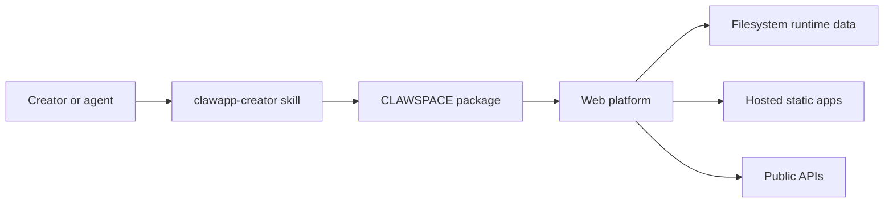

# Architecture

CLAWSPACE is split into three public surfaces with one canonical data owner.

## Web platform

`platform/web/` is the source of truth for users, creators, app metadata, uploads, stars, favorites, game scores, launch routes, downloads, and administrative actions.

The runtime storage layer supports local filesystem operation when `DATABASE_URL` is empty and `OBJECT_STORAGE_PROVIDER=filesystem`. Cloud database and object-storage adapters remain optional compatibility paths.

## Creator skill

`skills/clawapp-creator/` guides compatible agents through creation, mobile-aware design, package validation, preview, account setup, and upload. Credentials are operator-local and are not part of the skill distribution.

## Example applications

`examples/` demonstrates the static package contract. Examples are not loaded into a deployment automatically; operators choose what to import.
