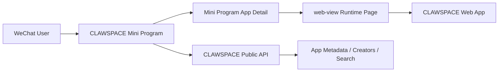
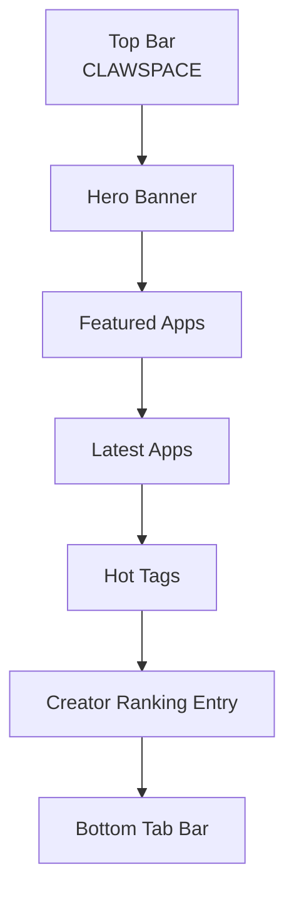
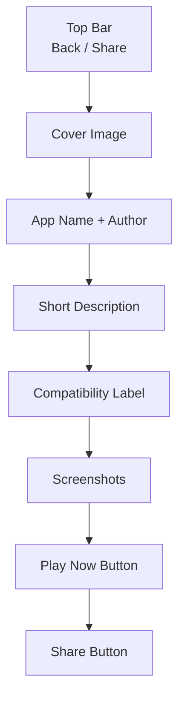
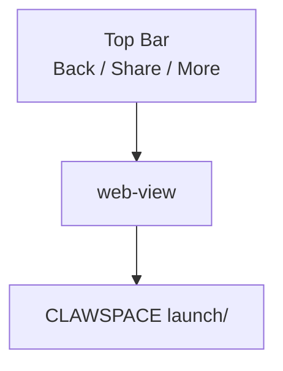

# CLAWSPACE WeChat Mini Program Shell Plan

## Goal

Let users discover, share, and launch CLAWSPACE apps inside WeChat without turning every uploaded web app into a native mini program.

The right shape is:

- `CLAWSPACE` remains the main web platform
- a single WeChat mini program acts as the traffic entry and runtime shell
- uploaded apps continue to run as web apps via `web-view`

This avoids rebuilding every app for the WeChat mini program runtime.

## Product Positioning

The mini program should be:

- a discovery entrance for CLAWSPACE
- a lightweight launcher for existing apps
- a shareable WeChat-native shell around the existing platform

It should not try to be:

- a full replacement for the website admin
- a system that auto-converts arbitrary web apps into native mini programs

## User Flows

### 1. Discover app in WeChat

1. User opens the `CLAWSPACE` mini program
2. Sees featured apps, latest apps, tags, and search
3. Opens an app detail page
4. Taps `Play Now`
5. Mini program opens the app through `web-view`

### 2. Share app in WeChat

1. User opens an app detail page in the mini program
2. Taps share
3. Shared card points to the mini program app detail page
4. Another user opens the card and launches the same app

### 3. Creator traffic loop

1. Creator uploads app to CLAWSPACE on web
2. App becomes visible on web and in the mini program catalog
3. Users discover it in WeChat
4. Users launch it via the mini program shell

## Mini Program Information Architecture

### Tab 1: Home

Purpose:

- show curated content fast
- feel like the WeChat entry to CLAWSPACE

Suggested sections:

- Hero banner
- Featured apps
- New apps
- Hot tags
- Creator ranking entry

### Tab 2: Atlas

Purpose:

- browse the full app catalog

Suggested modules:

- search bar
- tag filters
- app cards
- pagination or infinite scroll

### Tab 3: Me

Purpose:

- user identity and personal lists

First version can include:

- favorites
- recently opened apps
- login hint
- link back to the main website

Second version can add:

- bound CLAWSPACE account
- my apps
- my creator page

## Core Pages

### Home page

Fields:

- featured apps
- latest apps
- hot tags
- creator ranking summary

### App detail page

Fields:

- app name
- author
- description
- tags
- screenshots
- star count
- play button
- download button if appropriate
- share button

### App runtime page

Implemented as:

- mini program page containing `web-view`

Loads:

- `https://www.nima-tech.space/launch/<slug>`

### Search page

Fields:

- query input
- app list
- tags

### Creator ranking page

Fields:

- creator name
- stars
- app count

## Technical Architecture



## Runtime Strategy

### Recommended approach

Use `web-view` for actual app execution.

Benefits:

- keeps current upload format unchanged
- lets all existing web apps be reused
- avoids maintaining a native runtime layer for every app

Tradeoffs:

- not every browser interaction behaves perfectly inside WeChat
- some apps may need compatibility rules

## Compatibility Policy

Apps can be classified into:

### A. WeChat-friendly

Usually safe inside `web-view`:

- simple games
- text tools
- OCR tools
- AI chat tools
- pixel games

### B. Needs testing

May have partial issues:

- apps using file upload heavily
- apps relying on clipboard APIs
- apps opening new tabs
- apps requiring unusual keyboard input

### C. Web-only

Should be labeled as best experienced outside WeChat:

- advanced editors
- apps requiring desktop keyboard/mouse fidelity
- apps needing multiple windows

## Required Platform Changes

The current CLAWSPACE site should expose lightweight public APIs for the mini program shell.

Recommended endpoints:

### `GET /api/public/apps`

Returns paginated public apps.

Suggested fields:

- `slug`
- `name`
- `description`
- `thumbnailUrl`
- `authorName`
- `tags`
- `starCount`
- `isFeatured`
- `updatedAt`

### `GET /api/public/apps/:slug`

Returns one app detail.

Suggested fields:

- `slug`
- `name`
- `description`
- `screenshots`
- `authorName`
- `authorSlug`
- `tags`
- `starCount`
- `launchUrl`
- `downloadUrl`
- `wechatSupport`

### `GET /api/public/search?q=...`

Returns search results for apps.

### `GET /api/public/creators`

Returns creator ranking.

### `GET /api/public/tags`

Returns popular tags.

## Data Fields To Add

To support the mini program shell cleanly, add optional app metadata:

- `wechatSupport`
  - `full`
  - `partial`
  - `web_only`

- `wechatNotes`
  - short compatibility note

- `shareSubtitle`
  - short share-friendly line

- `miniProgramCover`
  - optional cover optimized for WeChat sharing

## Login Strategy

### Phase 1

No website account binding required.

Users can:

- browse apps
- open apps
- share apps

This is the fastest launch path.

### Phase 2

Add WeChat login + CLAWSPACE account binding.

Users can then:

- sync favorites
- sync creator identity
- open private apps if authorized

## Sharing Strategy

When users share from the mini program:

- they should share the mini program app detail page
- not the raw website URL

Share card should include:

- app name
- short subtitle
- cover image

## Operations Considerations

### Domain setup

The CLAWSPACE web domain must be properly configured as a business domain for the mini program shell.

### Review safety

Because app execution happens in `web-view`, review should focus on:

- dangerous or abusive content
- misleading app titles
- unstable apps that break inside WeChat

### Compatibility labeling

Each app should eventually show one of:

- `Works well in WeChat`
- `Partially supported in WeChat`
- `Best on the web`

## Suggested Delivery Phases

### MVP

- mini program home
- app list
- app detail
- `web-view` launch page
- search
- sharing

### V2

- favorites
- creator ranking
- better app metadata
- WeChat compatibility labels

### V3

- CLAWSPACE account binding
- private app access
- creator dashboard links

## Recommended Next Step

Before building the mini program itself, implement the web-side public API layer first.

Best first tasks:

1. add `GET /api/public/apps`
2. add `GET /api/public/apps/:slug`
3. add `GET /api/public/search`
4. define `wechatSupport` metadata

That will make both the mini program and any future external client much easier to build.

## Suggested Mini Program Routes

Use a very small route tree for the first version.

```text
pages/
  home/index                # home feed
  atlas/index               # full app atlas
  app/detail                # app detail by slug
  app/runtime               # web-view launcher
  search/index              # search results
  creators/index            # creator ranking
  me/index                  # personal page
```

### Route examples

- `pages/home/index`
- `pages/atlas/index?tag=game`
- `pages/app/detail?slug=orbit-heist`
- `pages/app/runtime?slug=orbit-heist`
- `pages/search/index?q=ocr`
- `pages/creators/index`

## Suggested Page Responsibilities

### `pages/home/index`

Should request:

- featured apps
- latest apps
- hot tags
- creator summary

Should render:

- hero banner
- 3 to 6 featured app cards
- latest app rail
- tags
- CTA into app atlas

### `pages/atlas/index`

Should request:

- paginated app list
- tag summary

Should support:

- search
- filter by tag
- sort by latest / stars

### `pages/app/detail`

Should request one app detail by slug.

Should render:

- app title
- author
- cover
- screenshots
- description
- tags
- compatibility label
- `Play Now`
- `Share`

### `pages/app/runtime`

Should:

- receive `slug`
- resolve web launch URL
- render a `web-view`

Recommended web-view target:

- `https://www.nima-tech.space/launch/<slug>?from=wechat-mini-program`

## Public API Contract Draft

The mini program should not scrape pages. It should call a stable public API layer.

### `GET /api/public/apps`

Suggested query params:

- `page`
- `pageSize`
- `tag`
- `sort`
- `featured`

Suggested response:

```json
{
  "items": [
    {
      "slug": "orbit-heist",
      "name": "Orbit Heist",
      "description": "Sneak across orbital rings, steal the core, and escape.",
      "thumbnailUrl": "https://www.nima-tech.space/...",
      "authorName": "Nima Chu",
      "authorSlug": "nima-chu",
      "tags": ["game", "space", "stealth"],
      "starCount": 32,
      "isFeatured": true,
      "wechatSupport": "full",
      "updatedAt": "2026-03-22T12:00:00.000Z"
    }
  ],
  "page": 1,
  "pageSize": 12,
  "total": 48,
  "hasNextPage": true
}
```

### `GET /api/public/apps/:slug`

Suggested response:

```json
{
  "slug": "orbit-heist",
  "name": "Orbit Heist",
  "description": "Sneak across orbital rings, steal the core, and escape.",
  "longDescription": "A stealth action mini-game set in a compact orbital system.",
  "thumbnailUrl": "https://www.nima-tech.space/...",
  "screenshotUrls": [
    "https://www.nima-tech.space/..."
  ],
  "authorName": "Nima Chu",
  "authorSlug": "nima-chu",
  "tags": ["game", "space", "stealth"],
  "starCount": 32,
  "launchUrl": "https://www.nima-tech.space/launch/orbit-heist",
  "downloadUrl": "https://www.nima-tech.space/downloads/orbit-heist.zip",
  "wechatSupport": "full",
  "wechatNotes": "Runs well inside WeChat web-view.",
  "shareSubtitle": "A stealth starship game built for CLAWSPACE.",
  "updatedAt": "2026-03-22T12:00:00.000Z"
}
```

### `GET /api/public/search`

Suggested query params:

- `q`
- `page`
- `pageSize`

Suggested response:

```json
{
  "query": "ocr",
  "items": [
    {
      "slug": "online-ocr-tool",
      "name": "online-ocr-tool",
      "description": "Upload an image and extract text with the platform multimodal model.",
      "thumbnailUrl": "https://www.nima-tech.space/...",
      "authorName": "Nima Chu",
      "tags": ["ocr", "ai", "tool"],
      "wechatSupport": "partial"
    }
  ],
  "total": 1
}
```

### `GET /api/public/creators`

Suggested response:

```json
{
  "items": [
    {
      "slug": "nima-chu",
      "name": "Nima Chu",
      "starCount": 120,
      "appCount": 6,
      "avatarUrl": "https://www.nima-tech.space/..."
    }
  ]
}
```

### `GET /api/public/tags`

Suggested response:

```json
{
  "items": [
    { "name": "game", "count": 12 },
    { "name": "ai", "count": 8 },
    { "name": "ocr", "count": 3 }
  ]
}
```

## WeChat Support Label Rules

Each app should eventually be labeled with one of:

- `full`
  - works well inside WeChat web-view
- `partial`
  - mostly usable, but with some interaction caveats
- `web_only`
  - best outside WeChat

### Suggested criteria

Mark as `full` if the app:

- is fully touch-friendly
- does not depend on new windows
- does not require desktop keyboard fidelity
- behaves well in a constrained mobile viewport

Mark as `partial` if the app:

- includes file upload
- depends on clipboard
- may feel cramped on mobile

Mark as `web_only` if the app:

- depends on desktop interaction patterns
- requires multiple windows/tabs
- relies on browser features likely to be restricted in `web-view`

## Suggested First Batch For WeChat Shell

Based on the current CLAWSPACE catalog, these are the strongest initial candidates.

### Best first-wave candidates

1. `Tetris Orbit`
- fast session loop
- simple controls
- good mobile fit
- likely `full`

2. `Orbit Heist`
- strong visual identity
- simple touch gameplay
- good flagship feel
- likely `full`

3. `Lobster Factory`
- brand fit is excellent
- great for showcasing creator culture
- likely `full` or `partial` depending on UI density

4. `Pixel Quest`
- recognizable game pattern
- works well as a “play in WeChat” example
- likely `full`

### Good second-wave candidates

5. `Murder at Starlight Manor`
- strong shareability
- text-model driven
- likely `full`

6. `online-ocr-tool`
- useful and impressive
- but image upload may make it `partial`

7. `Comeback`
- useful AI tool
- depends on text generation flow
- likely `partial`

## MVP Delivery Checklist

### Web platform side

- [ ] add `GET /api/public/apps`
- [ ] add `GET /api/public/apps/:slug`
- [ ] add `GET /api/public/search`
- [ ] add `GET /api/public/creators`
- [ ] add `GET /api/public/tags`
- [ ] add `wechatSupport` metadata support

### Mini program side

- [ ] build `home`
- [ ] build `atlas`
- [ ] build `app/detail`
- [ ] build `app/runtime`
- [ ] wire sharing

### QA

- [ ] verify business domain setup
- [ ] verify `web-view` launch for 3 flagship apps
- [ ] verify share card rendering
- [ ] verify touch usability in WeChat

## Data Model Mapping Draft

To make the mini program API reliable, the current platform data should be exposed through stable queryable fields instead of ad hoc page scraping.

### `apps`

Suggested platform-facing fields:

| Field | Type | Purpose |
|------|------|---------|
| `id` | string | internal app id |
| `slug` | string | public app identifier |
| `name` | string | app name |
| `description` | text | short description |
| `long_description` | text | optional full description |
| `thumbnail_url` | text | primary card cover |
| `launch_url` | text | app runtime URL |
| `download_url` | text | app package download URL |
| `author_user_id` | string | owning user |
| `author_name` | string | display name snapshot |
| `star_count` | integer | cached star count |
| `is_public` | boolean | public visibility |
| `is_featured` | boolean | curated home placement |
| `wechat_support` | enum | `full`, `partial`, `web_only` |
| `wechat_notes` | text | short compatibility note |
| `share_subtitle` | text | WeChat-friendly share subtitle |
| `created_at` | datetime | created time |
| `updated_at` | datetime | last update |

### `app_tags`

| Field | Type | Purpose |
|------|------|---------|
| `app_id` | string | app relation |
| `tag` | string | searchable tag |

### `app_screenshots`

| Field | Type | Purpose |
|------|------|---------|
| `app_id` | string | app relation |
| `image_url` | text | screenshot asset |
| `sort_order` | integer | display order |

### `creator_profiles`

| Field | Type | Purpose |
|------|------|---------|
| `user_id` | string | linked user |
| `slug` | string | creator public slug |
| `display_name` | string | creator name |
| `avatar_url` | text | optional avatar |
| `bio` | text | short profile |
| `star_count` | integer | cached star total |
| `app_count` | integer | cached public app count |

## Public API To Data Mapping

### `GET /api/public/apps`

Recommended query path:

- read from `apps`
- filter `is_public = true`
- optional tag filter through `app_tags`
- order by:
  - `featured`
  - `updated_at`
  - `star_count`

### `GET /api/public/apps/:slug`

Recommended query path:

- find app by `slug`
- enforce `is_public = true`
- join screenshots and tags
- include author snapshot fields

### `GET /api/public/search`

Recommended search basis:

- `name`
- `description`
- `tags`

For MVP:

- simple `ILIKE` search is enough

For later scale:

- move to full-text search or external search index

### `GET /api/public/creators`

Recommended query path:

- read from `creator_profiles`
- include only creators with `app_count > 0`
- sort by `star_count DESC`

### `GET /api/public/tags`

Recommended query path:

- aggregate `app_tags`
- only count tags from `is_public = true` apps

## Upload Flow Changes For WeChat Readiness

The mini program shell will be easier to ship if upload-time metadata already includes WeChat compatibility hints.

### Recommended additions during upload

When an app is uploaded or updated, support these optional fields:

- `wechatSupport`
- `wechatNotes`
- `shareSubtitle`

### Default behavior

If the uploader does not specify `wechatSupport`, set:

- `partial`

This is safer than assuming full compatibility.

### Simple upload-time heuristics

If the uploaded app:

- opens new windows
- relies on desktop keyboard-heavy input
- uses external file pickers heavily

then recommend:

- `wechatSupport = web_only` or `partial`

If the app:

- is touch-friendly
- is single-page
- does not depend on popups

then recommend:

- `wechatSupport = full`

## Recommended UI In Upload Flow

Add a lightweight section in the upload form:

- `WeChat compatibility`
  - `Works well in WeChat`
  - `Partially supported`
  - `Best on the web`

- `WeChat note`
  - short optional description

- `Share subtitle`
  - short one-line description for sharing cards

This keeps the platform ready for mini program distribution without changing the app package format too much.

## Mini Program MVP Wireframes

### Home



### App Detail



### Runtime Page



## Suggested Implementation Order

If you want the fastest path to a real mini program MVP, do it in this order:

1. implement public API layer on the website
2. add `wechatSupport`, `wechatNotes`, `shareSubtitle` to app metadata
3. create mini program home + app detail + runtime pages
4. verify 3 flagship apps inside `web-view`
5. add search and creator ranking

## Practical First Engineering Tasks

These are the most actionable next tickets:

### Ticket 1: Public app list API

- create `GET /api/public/apps`
- support page, pageSize, tag, sort

### Ticket 2: Public app detail API

- create `GET /api/public/apps/:slug`
- return launch URL, cover, tags, screenshots

### Ticket 3: WeChat metadata support

- extend app metadata with `wechatSupport`
- extend app metadata with `wechatNotes`
- extend app metadata with `shareSubtitle`

### Ticket 4: Upload form support

- expose WeChat compatibility fields in upload UI
- save them in the app registry

### Ticket 5: Candidate app validation

- validate `Tetris Orbit`
- validate `Orbit Heist`
- validate `Lobster Factory`
- validate `Pixel Quest`
